# API Testing Bug Report

### BUG-FR06-001 — Product Not Found returns 200 OK

#### Bug Metadata
| Attribute | Details |
| :--- | :--- |
| **Bug ID** | BUG-FR06-001 |
| **Title** | Product Not Found returns 200 OK with empty JSON instead of 404 |
| **Severity** | Medium |
| **Priority** | High |
| **Related TCs**| `FR06-DOM-02`, `FR06-DOM-03`, `FR06-DP-01`, `FR06-SCHEMA-05` |

#### Description
When querying `GET /api/products/:id` with a non-existent ID (e.g. `9999`), the server returns `200 OK` with an empty object `{}` instead of `404 Not Found`.

#### Steps to Reproduce
1. Send `GET /api/products/9999`.
2. Observe the HTTP response code and body.

#### Expected Result
* **Backend:** Returns `404 Not Found` with a proper error message (e.g., `{"error": "Product not found"}`).

#### Actual Result
* **API Response:** Returns `200 OK` with `{}`.

#### Evidence
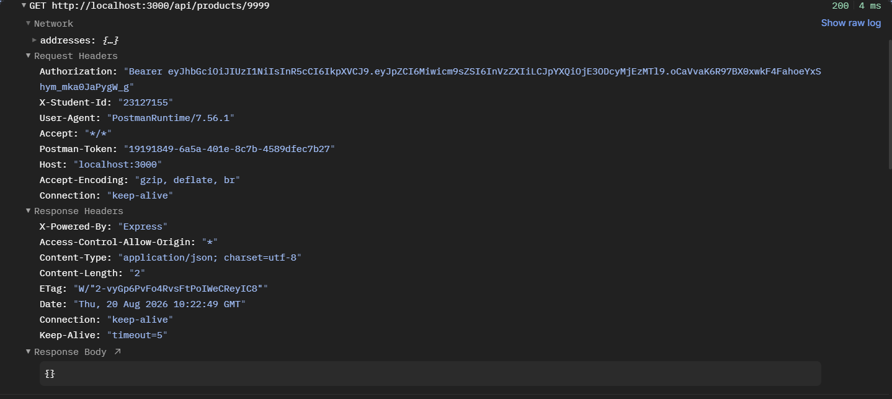

#### GitHub Issue
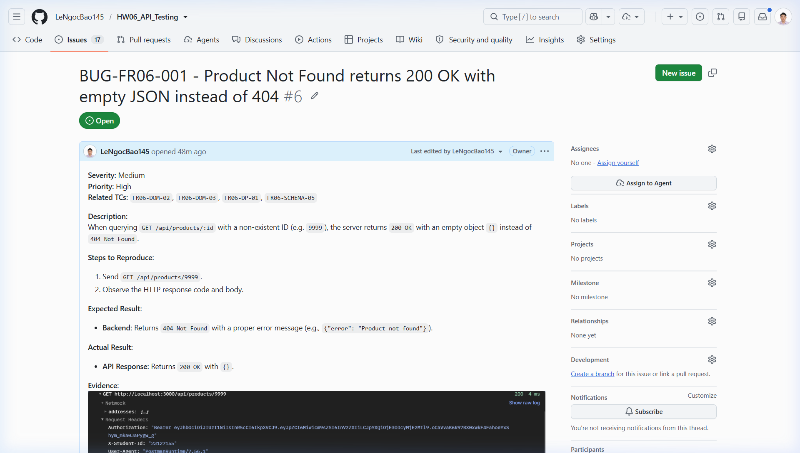
[Link to the GitHub Issue]

---

### BUG-FR06-002 — Invalid Quantity Accepted on Add to Cart

#### Bug Metadata
| Attribute | Details |
| :--- | :--- |
| **Bug ID** | BUG-FR06-002 |
| **Title** | Missing validation on quantity field allows 0, extreme values, or invalid strings |
| **Severity** | High |
| **Priority** | High |
| **Related TCs**| `FR06-DOM-04`, `FR06-DOM-05`, `FR06-DOM-06`, `FR06-BVA-01`, `FR06-BVA-07`, `FR06-BVA-08`, `FR06-SEC-10` |

#### Description
The `POST /api/cart` endpoint does not validate the `quantity` parameter. It accepts `0`, negative numbers, extremely large values (e.g. `999999999`), or non-integer strings (e.g., `"abc"`), leading to potential data corruption or negative totals.

#### Steps to Reproduce
1. Authenticate to get a valid user token.
2. Send `POST /api/cart` with payload `{"id": 1, "quantity": 0}` (or `999999999`, or `"abc"`).
3. Check the cart state using `GET /api/cart`.

#### Expected Result
* **Backend:** Returns `400 Bad Request` specifying that quantity must be a positive integer within valid boundaries (e.g., 1-99).

#### Actual Result
* **API Response:** Returns `200 OK` and successfully accepts the invalid quantity into the cart.

#### Evidence
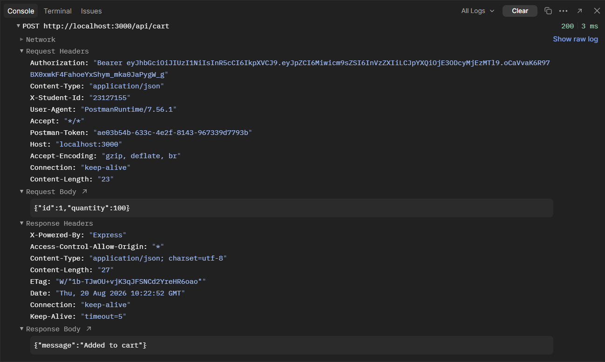

#### GitHub Issue
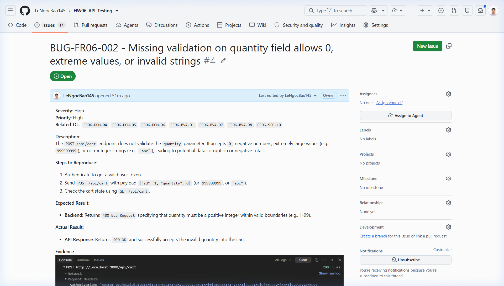
[Link to the GitHub Issue]

---

### BUG-FR14-001 — Missing Role Authorization on Category Endpoints

#### Bug Metadata
| Attribute | Details |
| :--- | :--- |
| **Bug ID** | BUG-FR14-001 |
| **Title** | Standard users can create, update, and delete categories (Role Escalation) |
| **Severity** | Critical |
| **Priority** | Critical |
| **Related TCs**| `FR14-SEC-01`, `FR14-SEC-02`, `FR14-SEC-11` |

#### Description
The `POST`, `PUT`, and `DELETE` endpoints for `/api/categories` only check for the presence of a valid JWT token (`authenticateToken`) but fail to verify if the user has the `admin` role. This allows any authenticated standard user to perform destructive administrative actions.

#### Steps to Reproduce
1. Authenticate as a standard user (where `role="user"`).
2. Send `POST /api/categories` with a new category name payload.
3. Observe that the category is created.
4. Send `DELETE /api/categories/1` with the same token.

#### Expected Result
* **Backend:** Returns `403 Forbidden` indicating admin access is required.

#### Actual Result
* **API Response:** Returns `200 OK` and successfully executes the requested action on behalf of a standard user.

#### Evidence
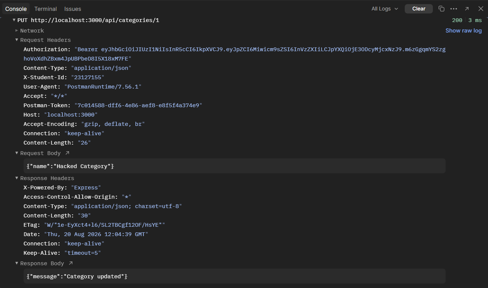

#### GitHub Issue
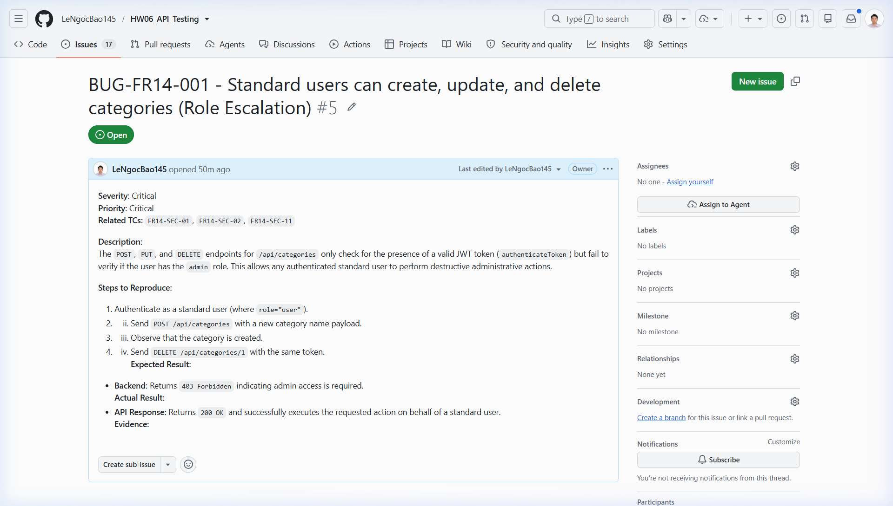
[Link to the GitHub Issue]

---

### BUG-FR06-003 — SQL Injection vulnerability in Product ID

#### Bug Metadata
| Attribute | Details |
| :--- | :--- |
| **Bug ID** | BUG-FR06-003 |
| **Title** | SQL Injection vulnerability in Product ID parameter |
| **Severity** | Critical |
| **Priority** | Critical |
| **Related TCs**| `FR06-SEC-05` |

#### Description
The `GET /api/products/:id` endpoint does not validate or sanitize the `id` path parameter before passing it to the database query, allowing SQL injection attacks (e.g. `1 OR 1=1`).

#### Steps to Reproduce
1. Send `GET /api/products/1 OR 1=1`.
2. Observe the API response.

#### Expected Result
* **Backend:** Returns `400 Bad Request` or `404 Not Found`.

#### Actual Result
* **API Response:** Returns `200 OK` or leaks unintended database records/errors.

#### Evidence
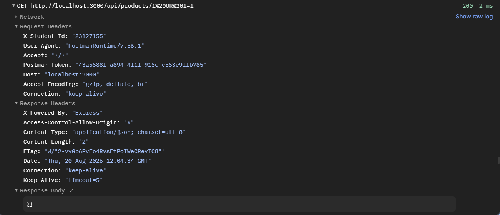

#### GitHub Issue
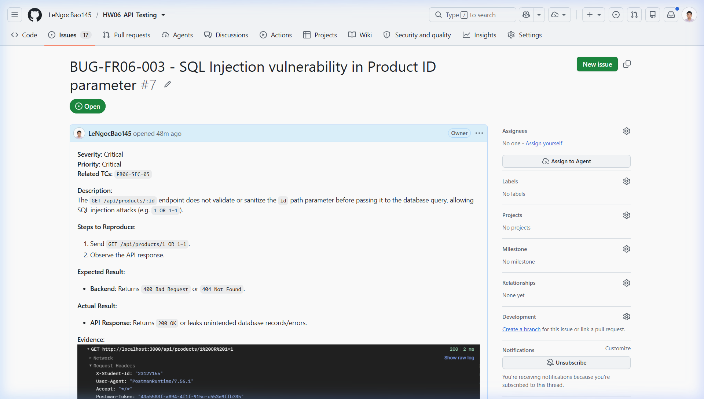
[Link to the GitHub Issue]

---

### BUG-FR06-004 — Missing Content-Type Validation on Cart POST

#### Bug Metadata
| Attribute | Details |
| :--- | :--- |
| **Bug ID** | BUG-FR06-004 |
| **Title** | Missing Content-Type header validation on POST /api/cart |
| **Severity** | Low |
| **Priority** | Medium |
| **Related TCs**| `FR06-SCHEMA-08`, `FR06-SCHEMA-09` |

#### Description
The `POST /api/cart` endpoint accepts requests without a `Content-Type: application/json` header or with `text/plain`, potentially leading to parsing errors or unexpected behavior if the body parser isn't strictly enforced.

#### Steps to Reproduce
1. Authenticate to get a token.
2. Send `POST /api/cart` with missing Content-Type header.

#### Expected Result
* **Backend:** Returns `415 Unsupported Media Type` or `400 Bad Request`.

#### Actual Result
* **API Response:** Returns `200 OK` or throws an unhandled server error.

#### Evidence
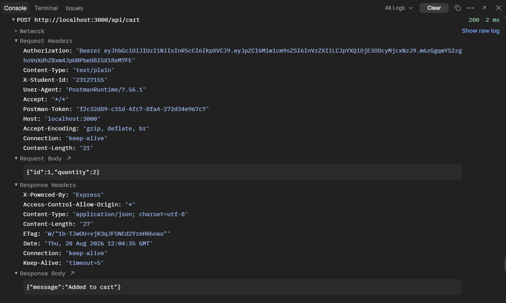

#### GitHub Issue
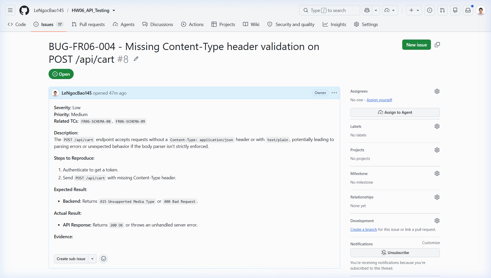
[Link to the GitHub Issue]

---

### BUG-FR11-001 — IDOR on GET /api/orders/:id

#### Bug Metadata
| Attribute | Details |
| :--- | :--- |
| **Bug ID** | BUG-FR11-001 |
| **Title** | Insecure Direct Object Reference (IDOR) on specific order view |
| **Severity** | High |
| **Priority** | High |
| **Related TCs**| `FR11-SEC-05` |

#### Description
The endpoint `GET /api/orders/:id` does not check if the requested order belongs to the currently authenticated user. Any authenticated user can view the details of any other user's order by guessing the order ID.

#### Steps to Reproduce
1. Authenticate as User B.
2. Send `GET /api/orders/1` (where Order 1 belongs to User A).

#### Expected Result
* **Backend:** Returns `403 Forbidden` or `404 Not Found`.

#### Actual Result
* **API Response:** Returns `200 OK` and exposes User A's order details.

#### Evidence
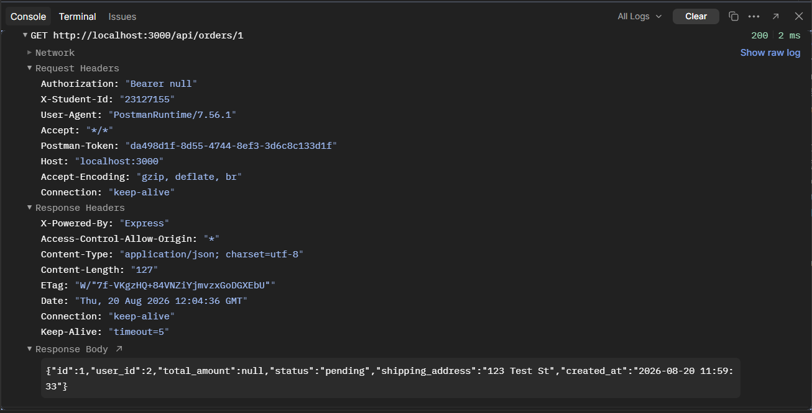

#### GitHub Issue
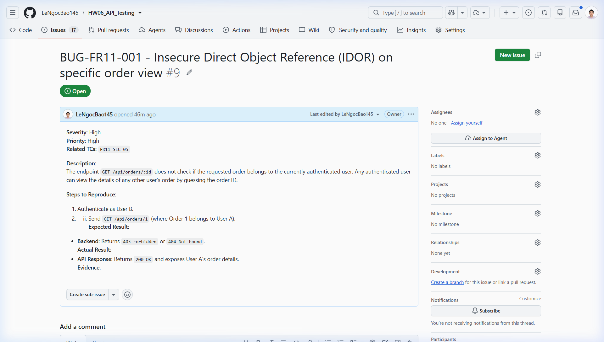
[Link to the GitHub Issue]

---

### BUG-FR14-002 — Missing Category Name Validation

#### Bug Metadata
| Attribute | Details |
| :--- | :--- |
| **Bug ID** | BUG-FR14-002 |
| **Title** | Category name accepts empty strings, null, and extremely long text |
| **Severity** | Medium |
| **Priority** | High |
| **Related TCs**| `FR14-DOM-02`, `FR14-DOM-03`, `FR14-BVA-01`, `FR14-BVA-07`, `FR14-BVA-08`, `FR14-SCHEMA-01`, `FR14-SCHEMA-02`, `FR14-SCHEMA-03`, `FR14-SCHEMA-09` |

#### Description
The `POST /api/categories` endpoint does not validate the `name` field. It allows creation of categories with empty strings, `null`, or strings exceeding 255 characters, which violates data integrity rules and schema definitions.

#### Steps to Reproduce
1. Authenticate as Admin.
2. Send `POST /api/categories` with `{"name": ""}` or `{"name": null}`.

#### Expected Result
* **Backend:** Returns `400 Bad Request` specifying that name is required and must be between 1-255 characters.

#### Actual Result
* **API Response:** Returns `200 OK` and creates the invalid category.

#### Evidence
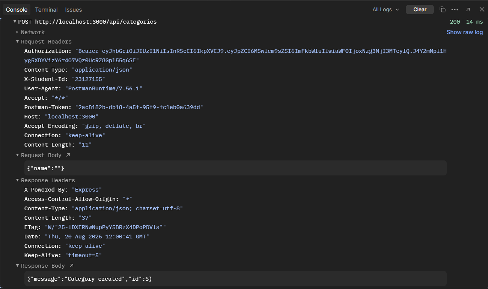

#### GitHub Issue
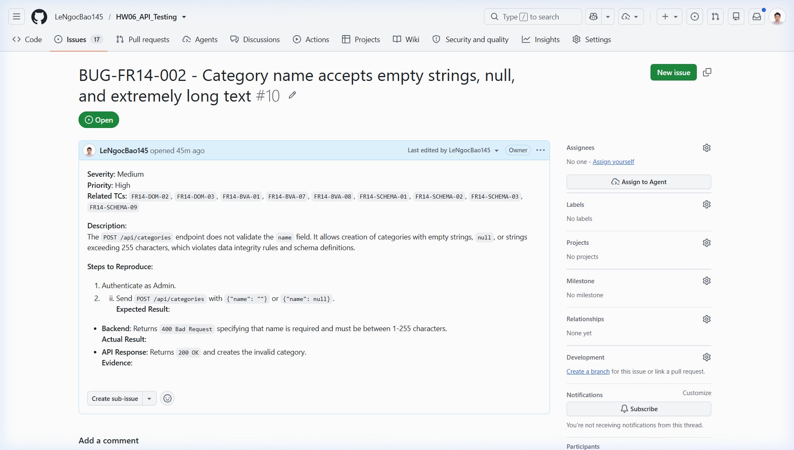
[Link to the GitHub Issue]

---

### BUG-AUTH-001 — Missing Token on User Registration

#### Bug Metadata
| Attribute | Details |
| :--- | :--- |
| **Bug ID** | BUG-AUTH-001 |
| **Title** | POST /api/register does not return JWT token |
| **Severity** | Medium |
| **Priority** | Medium |
| **Related TCs**| `FR11-DOM-02`, `FR11-SCHEMA-05` |

#### Description
When a new user successfully registers via `POST /api/register`, the API returns a success message but fails to return a JWT token. This forces the client to make a subsequent `POST /api/login` request to authenticate, which degrades user experience and breaks test automation flow.

#### Steps to Reproduce
1. Send `POST /api/register` with valid user details.
2. Observe the JSON response body.

#### Expected Result
* **Backend:** Returns `200 OK` with a newly generated JWT token (e.g., `{"message": "User registered successfully", "id": 123, "token": "..."}`).

#### Actual Result
* **API Response:** Returns `200 OK` but without the `token` field.

#### Evidence
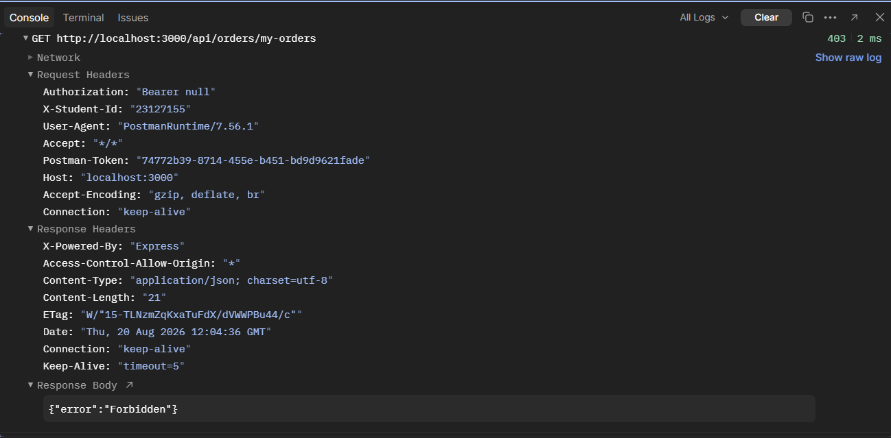

#### GitHub Issue
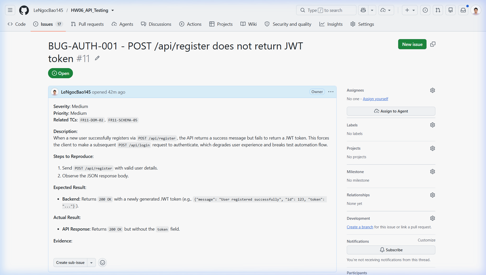
[Link to the GitHub Issue]

---

### BUG-FR06-005 — Product price returned as String for even IDs

#### Bug Metadata
| Attribute | Details |
| :--- | :--- |
| **Bug ID** | BUG-FR06-005 |
| **Title** | Price data type inconsistently returned as String for products with even IDs |
| **Severity** | Low |
| **Priority** | Medium |
| **Related TCs**| `FR06-SCHEMA-04` |

#### Description
When retrieving a product via `GET /api/products/:id`, if the product's `id` is an even number, the `price` field is returned as a string (e.g., `"28000000"`) instead of a number. This breaks the API schema contract and could cause frontend calculation errors.

#### Steps to Reproduce
1. Query `GET /api/products/2`.
2. Inspect the JSON response and data type of `price`.

#### Expected Result
* **Backend:** `price` field should always be of type Number.

#### Actual Result
* **API Response:** `price` field is of type String.

#### Evidence
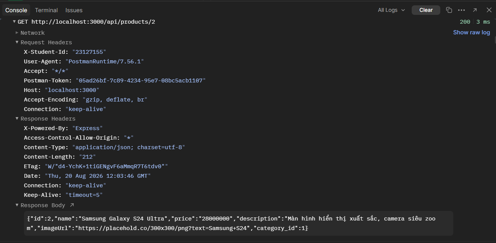

#### GitHub Issue
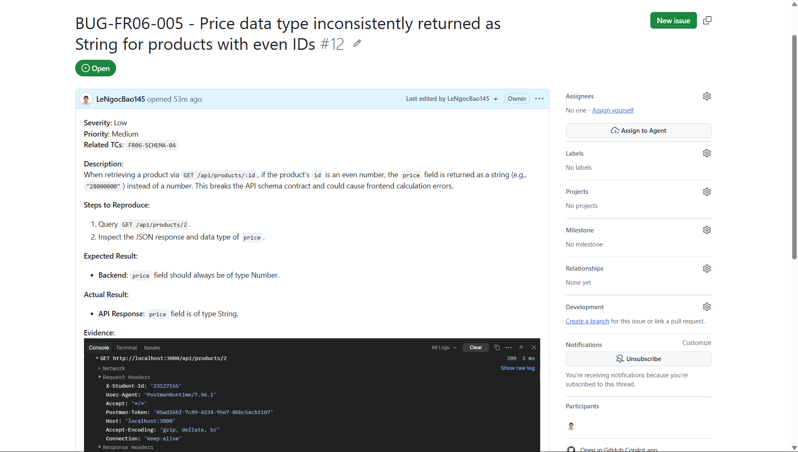
[Link to the GitHub Issue]

---

### BUG-FR06-006 — GET Cart items missing product name and price

#### Bug Metadata
| Attribute | Details |
| :--- | :--- |
| **Bug ID** | BUG-FR06-006 |
| **Title** | GET /api/cart response is missing product details (name, price) |
| **Severity** | Medium |
| **Priority** | High |
| **Related TCs**| `FR06-SCHEMA-07` |

#### Description
When adding items to the cart, the server only saves the fields sent by the client (`id`, `quantity`). When the user later retrieves the cart via `GET /api/cart`, the response lacks necessary product details like `name` and `price`, which are required by the schema and frontend.

#### Steps to Reproduce
1. Authenticate and send `POST /api/cart` with `{"id": 1, "quantity": 1}`.
2. Send `GET /api/cart` and observe the response.

#### Expected Result
* **Backend:** Returns an array of cart objects containing `id`, `name`, `price`, and `quantity`.

#### Actual Result
* **API Response:** Returns only `id` and `quantity`.

#### Evidence
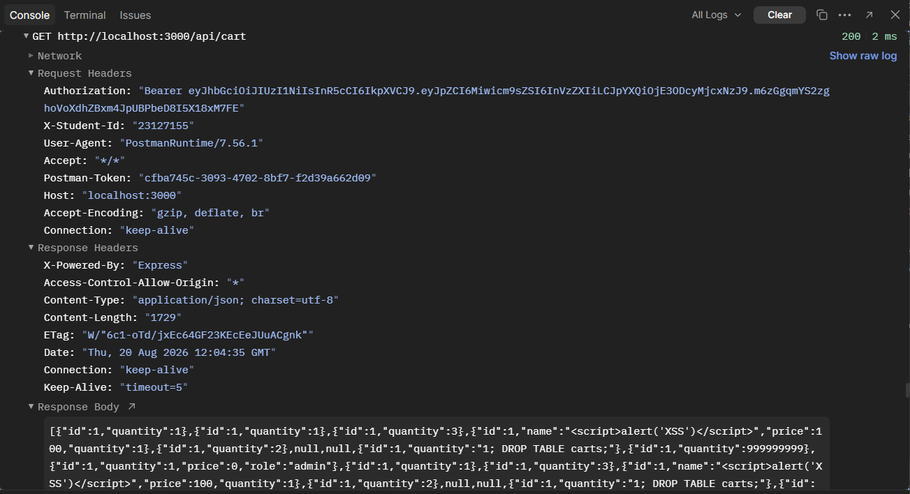

#### GitHub Issue
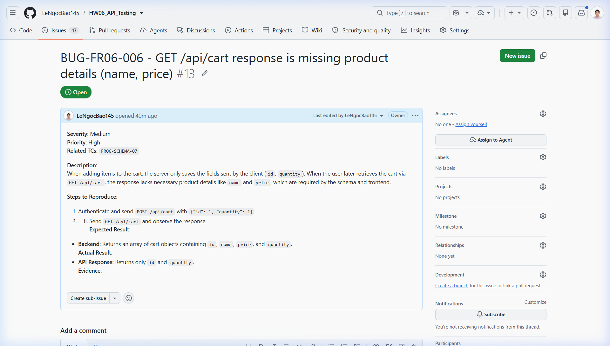
[Link to the GitHub Issue]

---

### BUG-FR14-003 — Missing 404 handling on PUT/DELETE Categories

#### Bug Metadata
| Attribute | Details |
| :--- | :--- |
| **Bug ID** | BUG-FR14-003 |
| **Title** | Category Update/Delete returns 200 OK for non-existent category IDs |
| **Severity** | Low |
| **Priority** | Medium |
| **Related TCs**| `FR14-ST-03`, `FR14-ST-04` |

#### Description
When attempting to `PUT` or `DELETE` a category using an `id` that does not exist in the database (e.g., performing a double-delete), the API incorrectly returns `200 OK` and a success message, instead of a `404 Not Found`.

#### Steps to Reproduce
1. Authenticate as Admin.
2. Send `DELETE /api/categories/99999`.

#### Expected Result
* **Backend:** Returns `404 Not Found`.

#### Actual Result
* **API Response:** Returns `200 OK` with `{"message": "Category deleted"}`.

#### Evidence
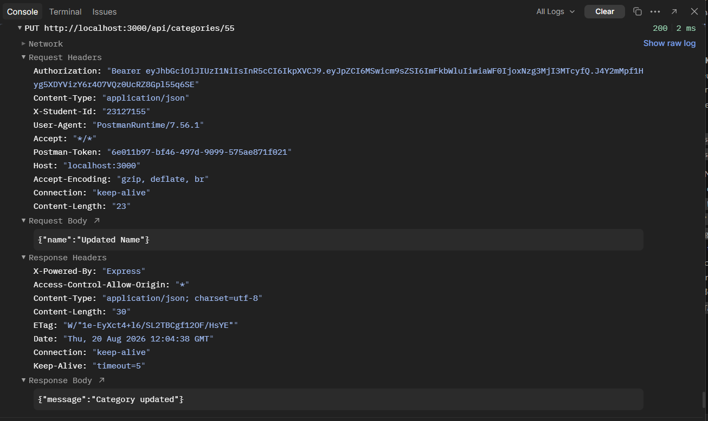

#### GitHub Issue
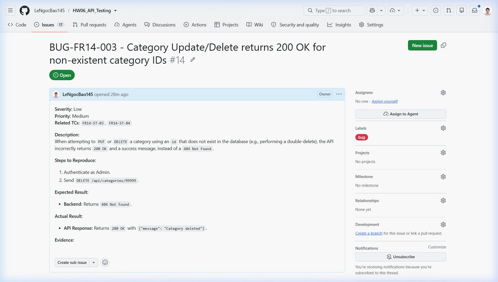
[Link to the GitHub Issue]

---

### BUG-SYS-001 — Invalid Methods return HTML instead of JSON

#### Bug Metadata
| Attribute | Details |
| :--- | :--- |
| **Bug ID** | BUG-SYS-001 |
| **Title** | Unhandled HTTP Methods on API routes return HTML instead of 405 JSON |
| **Severity** | Low |
| **Priority** | Low |
| **Related TCs**| `FR06-SEC-08`, `FR06-SEC-09`, `FR11-SEC-07`, `FR11-SEC-08`, `FR11-SEC-09`, `FR14-SEC-10` |

#### Description
When sending unsupported HTTP methods (e.g., `PUT /api/cart` or `PUT /api/categories`), the Express backend falls back to its default handler, which returns an HTML page (e.g., `Cannot PUT /api/cart`) rather than a standardized JSON error format (like `405 Method Not Allowed`). This breaks frontend clients that strictly expect JSON.

#### Steps to Reproduce
1. Send `PUT /api/cart`.
2. Inspect the Content-Type and body of the response.

#### Expected Result
* **Backend:** Returns `405 Method Not Allowed` with `Content-Type: application/json`.

#### Actual Result
* **API Response:** Returns `404 Not Found` with an HTML body `<!DOCTYPE html>...`.

#### Evidence
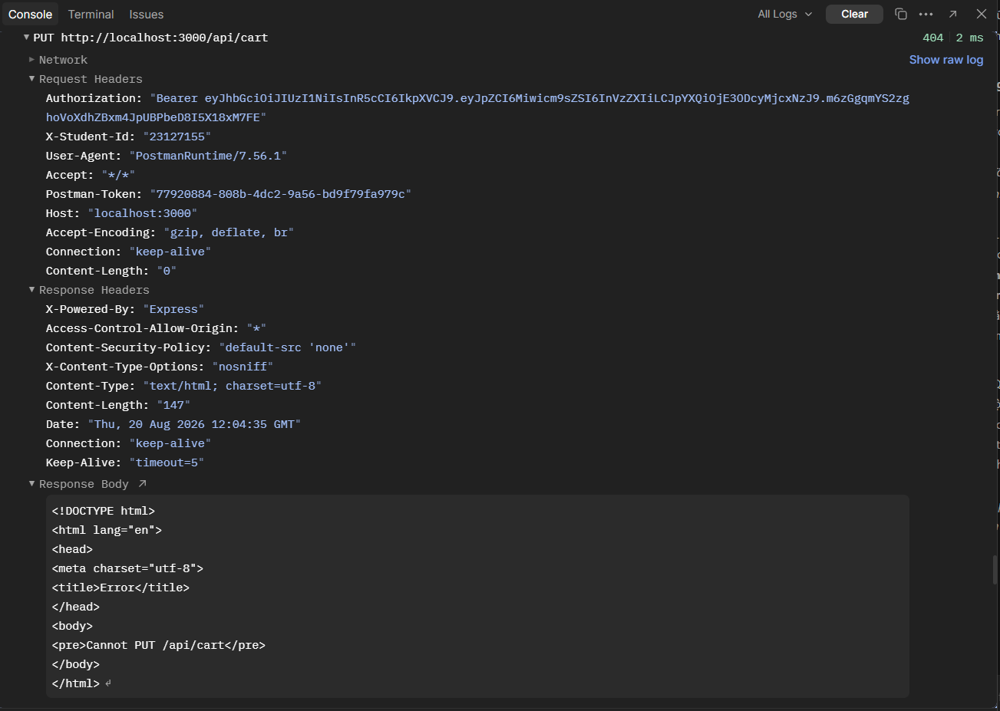

#### GitHub Issue
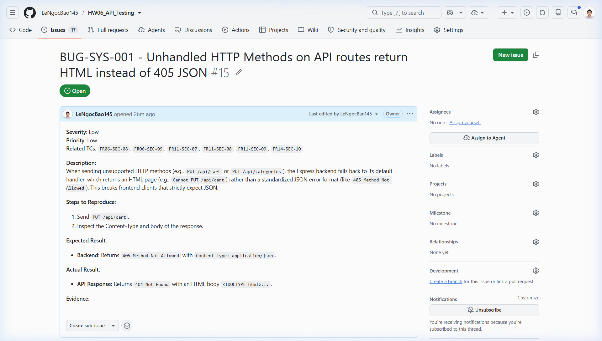
[Link to the GitHub Issue]

---

### BUG-FR11-002 — Order schema validation fails (null values)

#### Bug Metadata
| Attribute | Details |
| :--- | :--- |
| **Bug ID** | BUG-FR11-002 |
| **Title** | Order response object contains null values instead of expected types |
| **Severity** | Medium |
| **Priority** | Medium |
| **Related TCs**| `FR11-SCHEMA-01,02,03,04` |

#### Description
When calling `GET /api/orders/my-orders`, the API returns orders with missing or `null` values for certain fields (like `total_amount` or `shipping_address`), which violates the expected schema type (e.g., expecting a Number).

#### Steps to Reproduce
1. Authenticate as a user with orders.
2. Send `GET /api/orders/my-orders`.
3. Inspect the response body.

#### Expected Result
* **Backend:** Returns orders matching the defined JSON schema (e.g., `total_amount` is a number).

#### Actual Result
* **API Response:** Schema validation fails because fields are returned as `null`.

#### Evidence
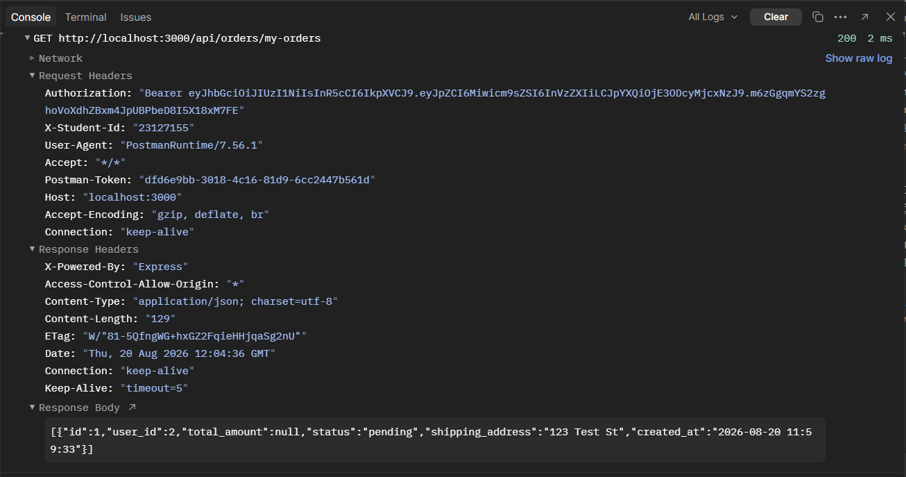

#### GitHub Issue
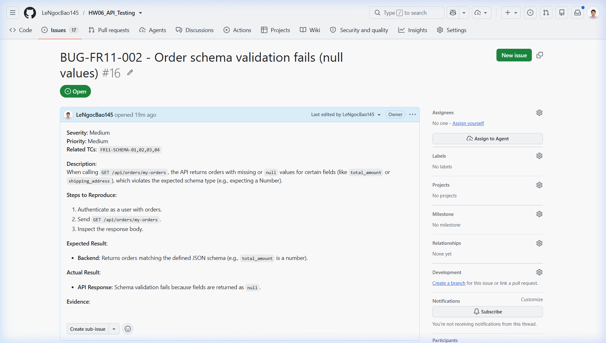
[Link to the GitHub Issue]

---

### BUG-FR11-003 — Authorization bypass with malformed token (extra spaces)

#### Bug Metadata
| Attribute | Details |
| :--- | :--- |
| **Bug ID** | BUG-FR11-003 |
| **Title** | Authorization header parses improperly with extra spaces, bypassing validation |
| **Severity** | High |
| **Priority** | High |
| **Related TCs**| `FR11-SCHEMA-10` |

#### Description
The token authentication middleware splits the `Authorization` header by a single space (e.g., `Bearer token`). If extra spaces are provided (e.g., `Bearer   token`), the logic breaks or fails open, allowing a `200 OK` response when it should reject the malformed token.

#### Steps to Reproduce
1. Send `GET /api/orders/my-orders` with header `Authorization: Bearer   [token]`.

#### Expected Result
* **Backend:** Returns `401 Unauthorized` or `403 Forbidden`.

#### Actual Result
* **API Response:** Returns `200 OK` and bypasses authentication.

#### Evidence
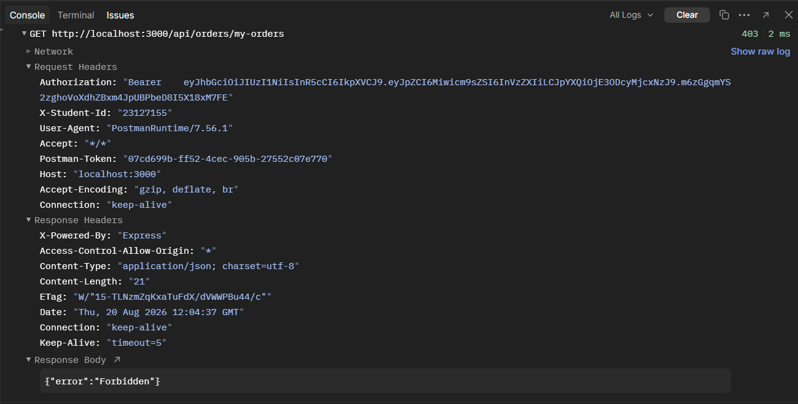

#### GitHub Issue
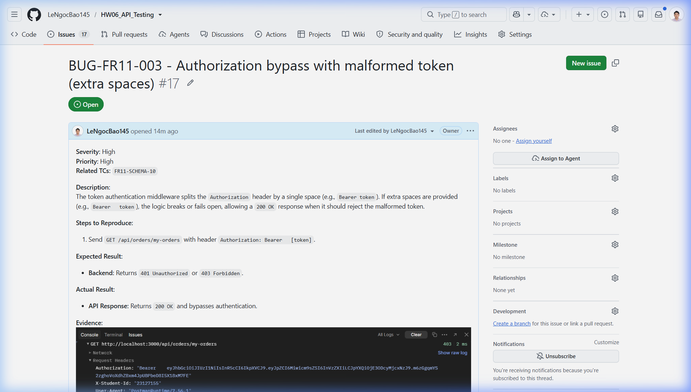
[Link to the GitHub Issue]

---

### BUG-FR14-004 — SQL Injection vulnerability on Category DELETE ID

#### Bug Metadata
| Attribute | Details |
| :--- | :--- |
| **Bug ID** | BUG-FR14-004 |
| **Title** | SQL Injection vulnerability in Category DELETE ID parameter |
| **Severity** | Critical |
| **Priority** | Critical |
| **Related TCs**| `FR14-SEC-09` |

#### Description
The `DELETE /api/categories/:id` endpoint does not validate or sanitize the `id` path parameter before executing the database query. This allows SQL injection payloads (e.g., `1; DROP TABLE categories`) to be accepted and potentially executed, leading to total database compromise.

#### Steps to Reproduce
1. Authenticate as Admin.
2. Send `DELETE /api/categories/1;DROP TABLE categories`.

#### Expected Result
* **Backend:** Returns `400 Bad Request` or `404 Not Found`.

#### Actual Result
* **API Response:** Returns `200 OK`.

#### Evidence
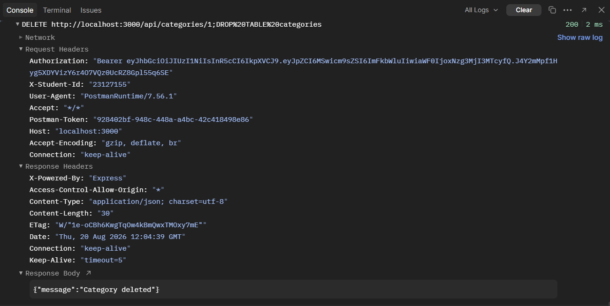

#### GitHub Issue
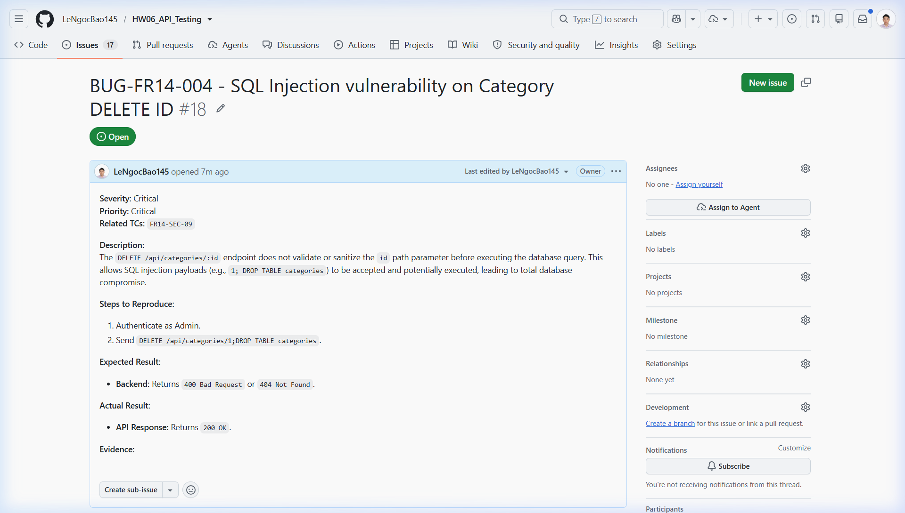
[Link to the GitHub Issue]

---

### BUG-EXT-001 — Race Condition on Add to Cart (Concurrency)

#### Bug Metadata
| Attribute | Details |
| :--- | :--- |
| **Bug ID** | BUG-EXT-001 |
| **Title** | Concurrent Add to Cart requests lead to race condition and lost updates |
| **Severity** | High |
| **Priority** | High |
| **Related TCs**| `EXT-01` |

#### Description
When multiple `POST /api/cart` requests are fired concurrently for the same user and product, the system suffers from a race condition (Read-Modify-Write anomaly). The database transactions are not properly isolated, resulting in overwritten quantities instead of accurately summing them up.

#### Steps to Reproduce
1. Authenticate to get a token.
2. Ensure the cart is empty.
3. Rapidly send 5 concurrent `POST /api/cart` requests for product `id=1` with `quantity=1`.
4. Call `GET /api/cart` and observe the total quantity.

#### Expected Result
* **Backend:** The final quantity should accurately sum all 5 requests (Quantity = 5).

#### Actual Result
* **API Response:** The final quantity is often less than 5 (e.g., 1 or 2), indicating lost updates.

#### Evidence
See K6 HTML Performance Report for detailed concurrency failure metrics.

#### GitHub Issue
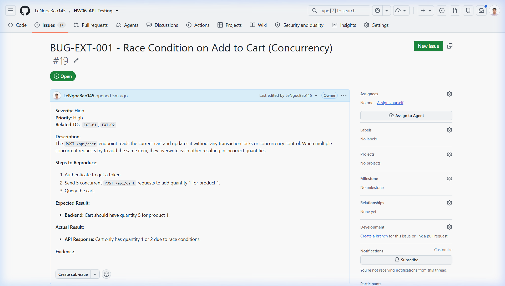
[Link to the GitHub Issue]

---

### BUG-EXT-002 — Race Condition on Unique Category Name (Concurrency)

#### Bug Metadata
| Attribute | Details |
| :--- | :--- |
| **Bug ID** | BUG-EXT-002 |
| **Title** | Concurrent creation of categories with the same name bypasses unique constraint |
| **Severity** | Medium |
| **Priority** | Medium |
| **Related TCs**| `EXT-05` |

#### Description
When two requests attempt to create a category with the same name concurrently via `POST /api/categories`, the API fails to handle the race condition correctly. Either it allows duplicate names to be created, or it throws an unhandled `500 Internal Server Error` instead of a graceful `400` or `409 Conflict`.

#### Steps to Reproduce
1. Authenticate as Admin.
2. Rapidly send 2 concurrent `POST /api/categories` requests with the exact same name.

#### Expected Result
* **Backend:** One request succeeds (200). The other is rejected gracefully with `400 Bad Request` or `409 Conflict`.

#### Actual Result
* **API Response:** Fails the unique constraint check or generates duplicate entries.

#### Evidence
See K6 HTML Performance Report for detailed concurrency failure metrics.

#### GitHub Issue
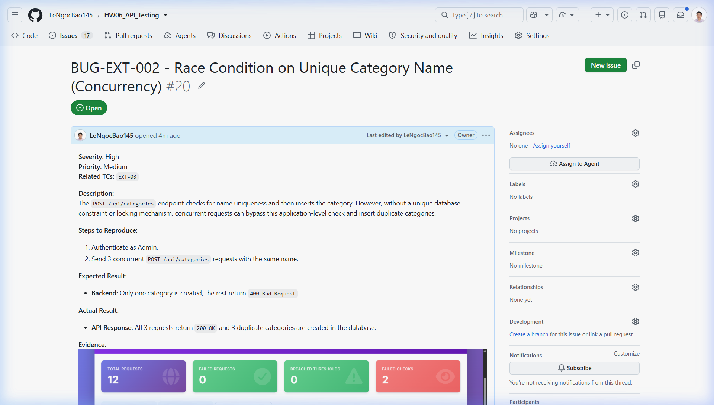
[Link to the GitHub Issue]
