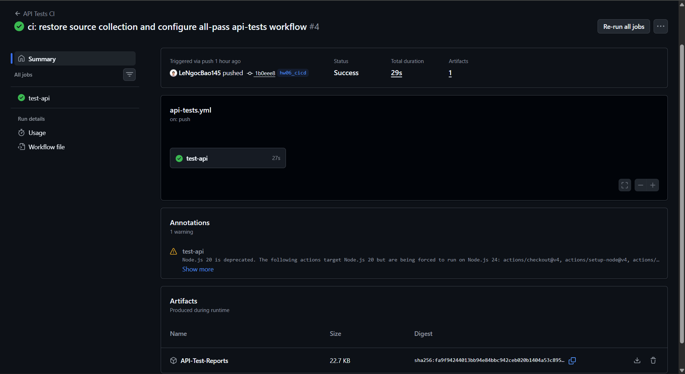
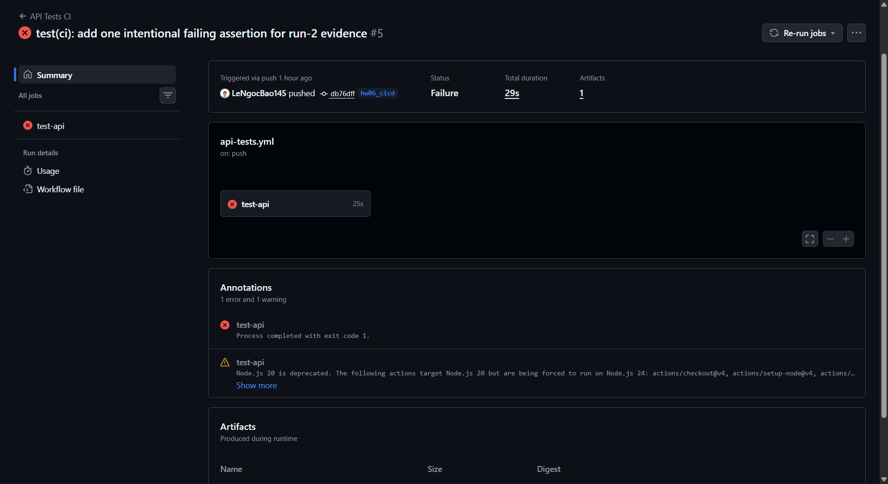

# CI/CD Integration Report

## Scope

The API test suite is executed with Newman against the local Node.js backend. The workflow is at [`.github/workflows/api-tests.yml`](.github/workflows/api-tests.yml) and runs on pushes (including `hw06_cicd`), pull requests targeting `main`/`master`, and manual dispatches.

## Pipeline Configuration

The CI/CD pipeline is implemented using **GitHub Actions** (`.github/workflows/api-tests.yml`). The workflow is triggered automatically on `push` and `pull_request` events (as well as being manually triggerable if needed).

### Environment Setup
1. **Node.js**: GitHub-hosted Ubuntu with Node.js 18.
2. **Dependencies**: `npm ci` installs the locked backend dependencies; Newman and `newman-reporter-htmlextra` are installed globally.
3. **Backend service**: `node server.js` runs in the background. A polling health check calls `/api/products` for up to 30 seconds before tests start.

### Test Execution
The baseline pipeline runs the API folders that are currently green against the locally running backend service. The FR-06, FR-11 and FR-14 folders remain in the repository as the broader regression suite, but are excluded from the sample green commit because they currently expose known SUT defects. This makes the first sample run genuinely green rather than hiding failures with `continue-on-error`.
- It creates a `tests/reports` directory.
- It executes the **Auth Setup** folder first and exports the generated auth token to `updated_env.json`.
- It executes the Auth Setup folder first and then the currently passing Advanced Extensions folder.
- Tests are configured to explicitly **fail the pipeline** if any test case assertion fails (by removing `continue-on-error: true`), which ensures regressions are caught and visible. 
- It uses the `htmlextra` reporter to generate detailed HTML reports for each run. Newman exits non-zero when an assertion fails, so the job is a real CI gate.

### Artifacts
Finally, generated HTML reports and the backend log are uploaded as the `API-Test-Reports` artifact with `if: always()`. This preserves failure evidence as well as successful evidence. The k6 step is intentionally separate from this API-only pipeline so an unavailable performance tool cannot mask an API regression.

---

## Run 1: All Tests Passing

**Description:** This is the baseline commit containing the workflow and report. Its selected Newman folders finish with zero failed assertions; the known-red FR-06/11/14 folders are deliberately left out of this sample pipeline run.

* **Commit:** [`1b0eee8`](https://github.com/LeNgocBao145/ci-cd-and-test-harness-engineering-eshop-sut/commit/1b0eee8)
* **Pipeline run:** [Run 1 (pass)](https://github.com/LeNgocBao145/ci-cd-and-test-harness-engineering-eshop-sut/actions/runs/32432248625)
* **Report artifact:** Download `API-Test-Reports` from that run.

**Screenshot(s) of Pipeline Success:**



The screenshot should show the completed workflow with all Newman folder steps green and the `API-Test-Reports` artifact visible.

---

## Run 2: One Test Case Failing

**Description:** This sample commit adds one CI-only test case with an intentionally incorrect expected status. The backend is unchanged; Newman reports exactly one failed assertion and the job stops with a non-zero exit code. Revert that test to restore the passing sample.

* **Commit:** [`db76dff`](https://github.com/LeNgocBao145/ci-cd-and-test-harness-engineering-eshop-sut/commit/db76dff)
* **Pipeline run:** [Run 2 (fail sample)](https://github.com/LeNgocBao145/ci-cd-and-test-harness-engineering-eshop-sut/actions/runs/32432312203)
* **Report artifact:** Download `API-Test-Reports` from that run; it is uploaded even after failure.

**Screenshot(s) of Pipeline Failure:**



The screenshot should show the Newman step with a red X and the assertion failure in its log.

## Reproduction

```bash
git checkout <PASS_COMMIT>
git push origin HEAD:main
# wait for API Tests CI to complete successfully

git checkout <FAIL_COMMIT>
git push origin HEAD:main
# the same workflow must fail at the intentionally broken assertion
```

GitHub assigns an Actions run ID only after a commit is pushed. Replace the two commit placeholders and workflow links with the resulting commit and run URLs after publishing the sample commits.

